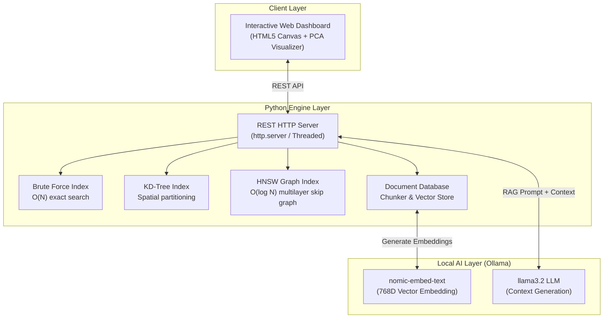

# 🚀 AI-Map — VectorDB Engine & RAG Visualizer (Python)

[](https://github.com)
[](https://www.docker.com/)
[](https://www.python.org/)
[](LICENSE)

A fully working **Vector Database** built from scratch in **Python** (using pure standard library) with an interactive web UI.  
Implements **HNSW**, **KD-Tree**, and **Brute Force** search algorithms side-by-side, plus a **RAG pipeline** powered by a local LLM via Ollama.

> **AI-Map** is built as an educational and production-grade project to show how vector databases like Pinecone, Weaviate, and Chroma actually work under the hood.

---

## 🌟 Executive Summary & Key Highlights

Most AI applications rely on heavy pre-packaged abstraction layers like ChromaDB or Pinecone. This project demonstrates low-level computer science fundamentals by engineering the spatial indexing data structures, distance metrics, and REST serving engine from first principles in Python:

* **Custom Multilayer HNSW Graph**: Implements Hierarchical Navigable Small World skip-graph indexing achieving $O(\log N)$ approximate nearest neighbor search.
* **Side-by-Side Algorithm Benchmarking**: Live microsecond-level performance benchmarking across **HNSW**, **KD-Tree**, and **Brute-Force** search.
* **Real-Time 2D PCA Visualizer**: Projects high-dimensional semantic vectors onto an interactive 2D HTML5 Canvas using Power Iteration Principal Component Analysis.
* **100% Private Offline RAG Pipeline**: Chunks documents, generates 768D embeddings (`nomic-embed-text`), retrieves top-$k$ context, and generates natural answers via a local LLM (`llama3.2`) with **zero cloud API costs**.
* **DevOps & Containerization**: Fully containerized using `docker-compose` with an automated AI model bootstrap script and GitHub Actions CI/CD pipeline publishing to **GitHub Container Registry (GHCR)**.
* **Zero External Python Dependencies**: Built using pure Python standard library (`http.server`, `heapq`, `urllib`, `threading`, `dataclasses`).

---

## 📋 Features Overview

| Feature | Description |
|---|---|
| **3 Search Algorithms** | HNSW (production-grade graph search), KD-Tree, Brute Force — run all three and compare speed & latency |
| **3 Distance Metrics** | Cosine similarity, Euclidean distance, Manhattan distance |
| **16D Demo Vectors** | 20 pre-loaded semantic vectors across 4 categories (CS, Math, Food, Sports) |
| **2D PCA Scatter Plot** | Live visualization of semantic space — watch clusters form |
| **Real Document Embedding** | Paste any text → Ollama embeds it with `nomic-embed-text` (768D) |
| **RAG Pipeline** | Ask questions about your documents → HNSW retrieves context → local LLM answers via Ollama (`llama3.2`) |
| **Full REST API** | CRUD endpoints: search, insert, delete, benchmark, hnsw-info, doc management, RAG |
| **Zero Dependencies** | Pure Python standard library implementation (`http.server`, `heapq`, `urllib`, `threading`) |
| **Full Docker & CI/CD** | 1-command startup with automated Ollama model pulling + GitHub Actions testing |

---

## 📐 System Architecture



---

## ⚙️ How It Works

```
Your Text
    │
    ▼
Ollama (nomic-embed-text)          ← converts text to a 768-dimensional vector
    │
    ▼
HNSW Index (Python)                ← indexes the vector in a multilayer graph
    │
    ▼
Semantic Search                    ← finds nearest neighbors in vector space
    │
    ▼
Ollama (llama3.2)                  ← reads retrieved chunks, generates an answer
    │
    ▼
Answer
```

**HNSW (Hierarchical Navigable Small World)** is the same algorithm used by Pinecone, Weaviate, Chroma, and Milvus. It builds a multilayer graph where each layer is progressively sparser — searches start at the top layer and zoom in, achieving $O(\log N)$ complexity instead of $O(N)$ for brute force.

---

## 🔬 Algorithmic Comparison & Math

| Algorithm | Index Construction | Search Complexity | Ideal Dataset Size | Characteristics |
|---|---|---|---|---|
| **Brute Force** | $O(1)$ | $O(N \cdot D)$ | $N < 1,000$ | 100% exact recall baseline; linear scan |
| **KD-Tree** | $O(N \log N)$ | $O(\log N)$ avg | $N < 100,000$ ($D < 20$) | Hyperplane spatial partitioning |
| **HNSW** | $O(N \log N)$ | $O(\log N)$ | $N > 1,000,000+$ | Production-grade probabilistic graph |

### Distance Metrics Implemented
* **Cosine Similarity**: $D_{\text{cos}}(a,b) = 1 - \frac{a \cdot b}{\|a\| \|b\|}$
* **Euclidean Distance (L2)**: $D_{\text{euc}}(a,b) = \sqrt{\sum (a_i - b_i)^2}$
* **Manhattan Distance (L1)**: $D_{\text{man}}(a,b) = \sum |a_i - b_i|$

---

## ⚡ Installation & Quick Start

### Option A: Containerized Deployment (Docker Compose)
Recommended for full stack evaluation. Provisions the VectorDB engine, Ollama service, and automates AI model bootstrapping in isolated containers:

1. Clone the repository:
   ```bash
   git clone https://github.com/the-raja/AI-Map.git
   cd AI-Map
   ```
2. Build and launch the container suite:
   ```bash
   docker compose up --build
   ```
3. Access the web interface at **`http://localhost:8080`**.

---

### Option B: Pre-built Container Execution (Registry Direct)
Recommended for zero-footprint testing without requiring local source code checkout:

```bash
docker run -p 8080:8080 ghcr.io/the3raja/ai-map:latest
```
Access the application interface at **`http://localhost:8080`**.

---

### Option C: Native Local Execution (Python 3.11+)
Recommended for local development, algorithm experimentation, or running outside containerized environments:

1. Clone the repository:
   ```bash
   git clone https://github.com/YOUR_USERNAME/AI-Map.git
   cd AI-Map
   ```
2. Execute automated unit test suite:
   ```bash
   python test_vectordb.py
   ```
3. Launch native HTTP serving engine:
   ```bash
   python main.py
   ```
4. Access the web interface at **`http://localhost:8080`**.

---

## 🖥️ Using the Application (Tab-by-Tab Guide)

### Tab 1: Search (Demo Vectors)
- Type any concept in the search box: `binary tree`, `sushi`, `basketball`, `calculus`
- Choose your algorithm: **HNSW**, **KD-Tree**, or **Brute Force**
- Choose distance metric: **Cosine**, **Euclidean**, or **Manhattan**
- Click **⚡ SEARCH** — results appear with distances, the matching point glows on the scatter plot
- Click **▶ COMPARE ALL ALGOS** to run all 3 algorithms and compare microsecond latency

**The scatter plot** shows all 20 vectors projected to 2D using PCA. Notice how the 4 semantic categories (CS, Math, Food, Sports) form distinct clusters.

### Tab 2: Documents (Real Embeddings)
- Paste any document, article, or notes text.
- Click **📥 INSERT DOCUMENT** — text is chunked into 250-word passages and embedded via Ollama (`nomic-embed-text`).
- Run semantic retrieval directly over your document set.

### Tab 3: RAG (Ask AI)
- Ask any question about your inserted documents.
- HNSW retrieves the most relevant passage chunks.
- The local LLM (`llama3.2`) synthesizes a direct answer using retrieved context.

---

## 📡 REST API Reference

### Demo Vector Endpoints
* `GET /search?v=...&k=5&metric=cosine&algo=hnsw` — Perform $k$-NN search
* `POST /insert` — Insert custom vector item (`{"metadata":"...","category":"...","embedding":[...]}`)
* `DELETE /delete/{id}` — Delete vector by ID
* `GET /items` — Fetch all stored vectors & metadata
* `GET /benchmark?v=...&k=5&metric=cosine` — Compare latency across all 3 algorithms
* `GET /hnsw-info` — Fetch multi-layer graph node/edge topology

### Document & RAG Endpoints
* `POST /doc/insert` — Chunk and embed raw document text (`{"title":"...","text":"..."}`)
* `DELETE /doc/delete/{id}` — Delete document chunk
* `GET /doc/list` — List all document chunks
* `POST /doc/search` — Perform semantic retrieval on docs (`{"question":"...","k":3}`)
* `POST /doc/ask` — Full RAG pipeline (`{"question":"...","k":3}`)
* `GET /status` — Engine health & Ollama model status
* `GET /stats` — Engine stats and supported algorithms/metrics

---

## 🛠️ Technology Stack

* **Core Engine**: Python 3.11 (Standard Library)
* **Web UI**: HTML5 Canvas, Vanilla CSS3 (Glassmorphism), JavaScript (ES6+)
* **Local LLM**: Ollama (`nomic-embed-text`, `llama3.2`)
* **DevOps**: Docker, Docker Compose, GitHub Actions CI/CD, GHCR

---

## 📄 License

Distributed under the MIT License. See `LICENSE` for details.
