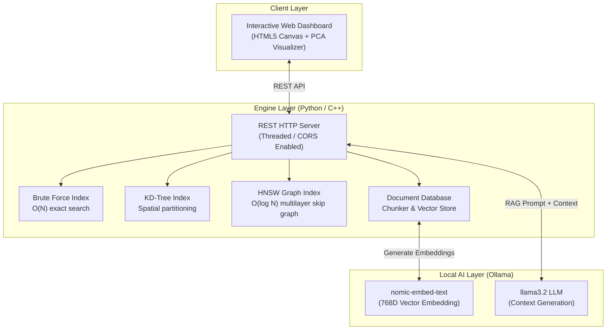

# 🚀 VectorDB Engine & RAG Visualizer

[](https://github.com)
[](https://www.docker.com/)
[](https://www.python.org/)
[](https://isocpp.org/)
[](LICENSE)

> A production-grade **Vector Database Engine & RAG Visualizer** built **from scratch** in both **Python** and **C++** (zero third-party vector DB wrappers).  
> Features custom implementations of **HNSW**, **KD-Tree**, and **Brute-Force** spatial indexes, real-time **2D PCA dimensionality reduction visualization**, and an offline **RAG (Retrieval-Augmented Generation)** pipeline powered by local LLMs via Ollama.

---

## 🌟 Executive Summary

Most AI applications rely on heavy pre-packaged abstraction layers like ChromaDB or Pinecone. This project demonstrates low-level computer science fundamentals by engineering the spatial indexing data structures, distance metrics, and REST serving engine from first principles:

* **Custom Multilayer HNSW Graph**: Implements Hierarchical Navigable Small World skip-graph indexing achieving $O(\log N)$ approximate nearest neighbor search.
* **Side-by-Side Algorithm Benchmarking**: Live microsecond-level performance benchmarking across **HNSW**, **KD-Tree**, and **Brute-Force** search.
* **Real-Time 2D PCA Visualizer**: Projects high-dimensional semantic vectors onto an interactive 2D HTML5 Canvas using Power Iteration Principal Component Analysis.
* **100% Private Offline RAG Pipeline**: Chunks documents, generates 768D embeddings (`nomic-embed-text`), retrieves top-$k$ context, and generates natural answers via a local LLM (`llama3.2`) with **zero cloud API costs**.
* **DevOps & Containerization**: Fully containerized using `docker-compose` with an automated AI model bootstrap script and GitHub Actions CI/CD pipeline publishing to **GitHub Container Registry (GHCR)**.

---

## 📐 System Architecture



---

## 🔬 Algorithmic Comparison

| Algorithm | Index Construction | Search Complexity | Ideal Dataset Size | Characteristics |
|---|---|---|---|---|
| **Brute Force** | $O(1)$ | $O(N \cdot D)$ | $N < 1,000$ | 100% exact recall baseline; linear scan |
| **KD-Tree** | $O(N \log N)$ | $O(\log N)$ avg | $N < 100,000$ ($D < 20$) | Hyperplane spatial partitioning |
| **HNSW** | $O(N \log N)$ | $O(\log N)$ | $N > 1,000,000+$ | Production-grade probabilistic graph |

### Distance Metrics Implemented
* **Cosine Similarity**: $D_{\text{cos}}(a,b) = 1 - \frac{a \cdot b}{\|a\| \|b\|}$
* **Euclidean Distance (L2)**: $D_{\text{euc}}(a,b) = \sqrt{\sum (a_i - b_i)^2}$
* **Manhattan Distance (L1)**: $D_{\text{man}}(a,b) = \sum |a_i - b_i|$

---

## ⚡ Quick Start

### Option 1: Docker (Recommended — 1 Command)

No dependencies required! Docker automatically boots Ollama, downloads the AI models, and launches the VectorDB application:

```bash
docker compose up --build
```

Access the visual dashboard at **`http://localhost:8080`**.

### Option 2: Native Python

```bash
# Run unit tests
python test_vectordb.py

# Start VectorDB server
python main.py
```

### Option 3: High-Performance C++ Engine

```bash
# Compile with GCC -O2 optimizations
g++ -std=c++17 -O2 main.cpp -o db -lws2_32

# Run executable
./db
```

---

## 📡 REST API Reference

### Vector Operations
* `GET /search?v=...&k=5&metric=cosine&algo=hnsw` — Perform $k$-NN search
* `POST /insert` — Insert custom vector item
* `GET /items` — Fetch all stored vectors & metadata
* `GET /benchmark?v=...&k=5&metric=cosine` — Compare latency across all 3 algorithms
* `GET /hnsw-info` — Fetch multi-layer graph node/edge topology

### RAG & Document Pipeline
* `POST /doc/insert` — Chunk and embed raw document text
* `GET /doc/list` — List all document chunks
* `POST /doc/ask` — Execute end-to-end RAG query pipeline (`question` $\rightarrow$ `embed` $\rightarrow$ `retrieve` $\rightarrow$ `LLM generate`)
* `GET /status` — Engine health & Ollama model status

---

## 🛠️ Technology Stack

* **Core Logic**: Python 3.11 (Standard Library) / C++17
* **Web UI**: HTML5 Canvas, Vanilla CSS3 (Glassmorphism), JavaScript (ES6+)
* **Local LLM**: Ollama (`nomic-embed-text`, `llama3.2`)
* **DevOps**: Docker, Docker Compose, GitHub Actions CI/CD, GHCR

---

## 📄 License

Distributed under the MIT License. See `LICENSE` for details.
